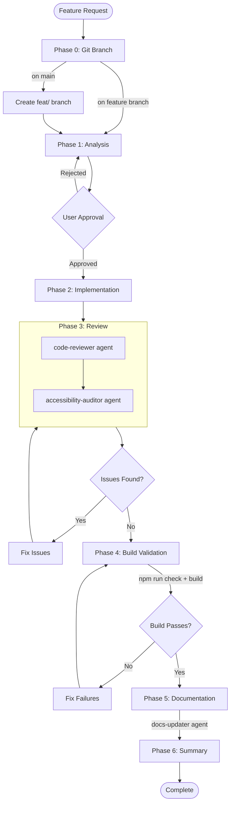
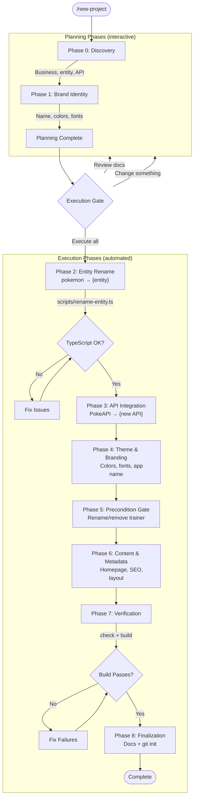

# Claude Code Configuration

> Custom commands, skills, and agents for the Snap codebase.

## Overview

This directory contains Claude Code customizations:

- **Commands** — Slash commands that trigger specific workflows
- **Skills** — Knowledge that Claude applies automatically when relevant
- **Agents** — Specialized subagents that handle specific tasks

## Quick Start

```bash
# Initialize a new project from this boilerplate
/new-project a recipe discovery app using TheMealDB API

# Run the full feature workflow
/workflow-project implement Pokemon comparison feature

# Plan tasks for a feature
/plan-tasks-project add team builder page

# Skills trigger automatically based on your request
"Create a tRPC router for abilities"       → uses trpc-router skill
"Add a component for Pokemon teams"        → uses domain-component skill
"Show a success notification"              → uses notification skill
"Add page transitions to the team page"    → uses view-transition skill
```

## Commands

| Command | Purpose | When to Use |
|---------|---------|-------------|
| `/new-project` | Transform boilerplate into a new branded app | Starting a new project from this template |
| `/workflow-project` | Full feature development workflow | New features, significant changes |
| `/plan-tasks-project` | Break down a feature into subtasks | Planning phase only |

### `/workflow-project` — Complete Feature Development

Guides you through all phases:

1. **Phase 0: Git Branch** — Ensures you're on a feature branch
2. **Phase 1: Analysis** — Creates technical analysis with code examples
3. **Phase 2: Implementation** — Implements following project patterns
4. **Phase 3: Review** — Code review via `code-reviewer` + `accessibility-auditor` agents
5. **Phase 4: Build Validation** — Type check + production build
6. **Phase 5: Documentation** — Updates docs via `docs-updater` agent
7. **Phase 6: Summary** — Lists changes and follow-ups



### `/new-project` — Initialize New Project from Boilerplate

Transforms the Pokemon-themed boilerplate into a new domain-specific application:

1. **Phase 0: Discovery** — Business info, entity name, external API
2. **Phase 1: Brand Identity** — App name, colors, fonts, visual style
3. **Phase 2: Entity Rename** — Rename "pokemon" to new domain via `scripts/rename-entity.ts`
4. **Phase 3: API Integration** — Point tRPC router to new external API
5. **Phase 4: Theme & Branding** — Apply colors, fonts, replace "Snap" references
6. **Phase 5: Precondition Gate** — Rename/remove "trainer" concept
7. **Phase 6: Content & Metadata** — Homepage copy, SEO, layout text
8. **Phase 7: Verification** — TypeScript + lint + build
9. **Phase 8: Finalization** — Update docs + git init



### `/plan-tasks-project` — Task Planning

Breaks down a feature into atomic, trackable subtasks:

```
docs/features/{feature}/
├── analysis.md
└── tasks/
    ├── README.md
    ├── api-001-{name}.md
    ├── frontend-001-{name}.md
    └── ...
```

## Skills

Skills provide Claude with project-specific knowledge. They trigger automatically.

| Skill | Triggers When You... |
|-------|---------------------|
| **trpc-router** | Create API endpoints, add tRPC procedures |
| **domain-component** | Create React components, compound components |
| **service-hook** | Create hooks that wrap tRPC calls with prefetching |
| **notification** | Display messages to users |
| **feature-workflow** | Implement new features (alternative to /workflow) |
| **view-transition** | Add page transition animations |

### Critical Patterns (Apply Everywhere)

| Pattern | Rule |
|---------|------|
| **Notifications** | Use `useNotificationDispatcher` from `~/events`, never Mantine directly |
| **Navigation** | Use `NavLink` from `~/shared/components/NavigationLoader` |
| **Data fetching** | Use service hooks from `~/domains/<domain>/hooks`, never direct tRPC |
| **Prefetching** | Add `usePrefetch*` methods, use on `onMouseEnter` |
| **CSS** | Mobile-first `min-width`, Mantine variables only, `light-dark()` |
| **Inline styles** | Theme callback: `styles={(theme) => (...)}` |
| **Theme colors** | Extend defaults: `colors: { brand: ... }`, never replace |
| **ViewTransitions** | Use `useViewTransition` from `~/state` |
| **Env vars** | Use `env.VARNAME` from `~/env.mjs`, never `process.env` |
| **Hydration** | Defer client-only values to `useEffect` or `mounted` guard |
| **Smooth scroll** | `useLenis` / `LenisConfig` from `~/state`, `data-lenis-prevent` to opt out |
| **Network monitor** | `NetworkStatusMonitor` in providers — auto-detects offline/slow and dispatches notifications |

## Agents

| Agent | Purpose | Used In |
|-------|---------|---------|
| **code-reviewer** | Code quality, patterns, critical rules | /workflow Phase 3 |
| **accessibility-auditor** | WCAG 2.1 AA compliance auditing | /workflow Phase 3 |
| **docs-updater** | Updates project documentation | /workflow Phase 5 |
| **frontend-patterns** | UI consistency and pattern enforcement | On request |

### Invoking Agents Directly

```
Use the code-reviewer agent to review my recent changes
Have the docs-updater update the docs for the new feature
Use frontend-patterns to check the new component
```

## Directory Structure

```
.claude/
├── README.md
├── commands/
│   ├── new-project.md            # Initialize new project from boilerplate
│   ├── workflow-project.md       # Full feature workflow
│   └── plan-tasks-project.md     # Task planning
├── skills/
│   ├── trpc-router/SKILL.md      # tRPC router patterns
│   ├── domain-component/SKILL.md # Domain component patterns
│   ├── service-hook/SKILL.md     # Service hook patterns
│   ├── notification/SKILL.md     # Notification patterns
│   ├── feature-workflow/SKILL.md # Feature workflow skill
│   └── view-transition/SKILL.md  # View transition patterns
└── agents/
    ├── code-reviewer.md          # Code review specialist
    ├── accessibility-auditor.md  # WCAG 2.1 AA compliance
    ├── docs-updater.md           # Documentation updater
    └── frontend-patterns.md      # UI pattern enforcement
```

## Key Differences

| Aspect | Commands | Skills | Agents |
|--------|----------|--------|--------|
| **Invocation** | Explicit (`/command`) | Automatic | Delegated by workflow |
| **Context** | Main conversation | Main conversation | Separate context |
| **Purpose** | Orchestrate workflows | Add knowledge | Execute specialized tasks |
| **Best for** | Multi-phase work | Patterns, templates | Focused expertise |
