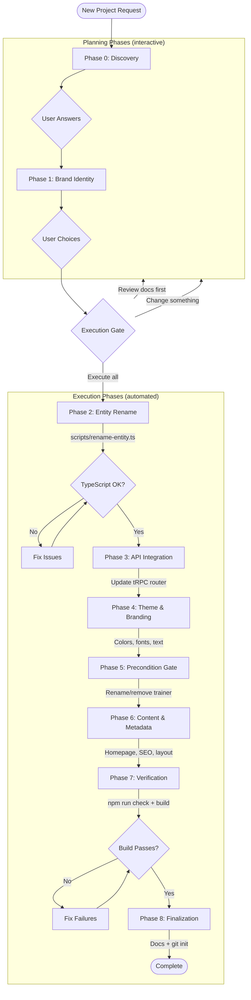

# New Project Initializer

You are the project initialization orchestrator that transforms the Snap boilerplate into a new branded application.

## Purpose

This command converts the Pokemon-themed boilerplate into a **new domain-specific application**. It renames the reference entity (Pokemon), connects a new external API, applies branding, and updates all boilerplate text.

**Preserved in every project:** Domain-driven architecture, tRPC patterns, compound components, service hooks with prefetching, deferred actions, view transitions, event system, mobile-first CSS, notification dispatcher, and all code standards.

## Phase Overview

**Planning Phases (interactive — collect user decisions):**

| Phase | Name | Purpose |
|-------|------|---------|
| 0 | Discovery | Business info, entity name, external API |
| 1 | Brand Identity | App name, colors, fonts, visual style |

**Execution Gate:** Single user confirmation before all execution phases.

**Execution Phases (automated — run without interruption):**

| Phase | Name | Purpose |
|-------|------|---------|
| 2 | Entity Rename | Rename "pokemon" to new domain entity via script |
| 3 | API Integration | Point tRPC router to new external API |
| 4 | Theme & Branding | Apply colors, fonts, update all text references |
| 5 | Precondition Gate | Rename or remove "trainer" concept |
| 6 | Content & Metadata | Homepage copy, SEO, layout text |
| 7 | Verification | TypeScript, lint, build |
| 8 | Finalization | Update docs + initialize git |



## Initialization Request

**ANALYZE** the request: "$ARGUMENTS"

If no arguments provided, begin with Phase 0 (Discovery).

---

## Phase 0: Discovery

```
PHASE 0: Discovery

Welcome! Let's transform the Snap boilerplate into your new project.

I'll ask a few questions to understand what you're building.
Don't worry if you don't have all the answers — I can help!
```

### Discovery Questions

Ask using AskUserQuestion tool. Group related questions (max 4 per call).

**Business Identity:**
- Project/business name (options: have one / brainstorm with me / not sure yet)
- One-line description (options: have one / write for me / skip for now)
- Industry/niche (Food, Sports, Music, Movies, Books, Gaming, Travel, Tech, Other)

**Domain Entity:**
The boilerplate uses "Pokemon" as its reference entity. What entity will your app browse/explore?

Examples by industry:
- Food: Recipe, Dish, Cocktail
- Sports: Player, Team, Athlete
- Music: Artist, Album, Song
- Movies: Film, Movie, Show
- Books: Book, Novel, Author
- Gaming: Game, Character, Item
- Travel: Destination, Hotel, Trail
- Tech: Repository, Package, Tool

```
Question: "What is the primary entity your app will display?"
Options:
  - "Recipe" / "Player" / "Film" / etc. (common suggestions based on industry)
  - "Custom — I'll type it"
  - "Help me decide"
```

**External API:**
The boilerplate fetches from PokeAPI. What API will your app use?

```
Question: "What external API will provide your data?"
Options:
  - "I have a specific API" → Collect: base URL, key endpoints (list + detail), auth method
  - "Help me find one" → Suggest free public APIs for their industry
  - "I'll build my own later" → Keep PokeAPI structure as placeholder, document the swap points
  - "Use a mock/static data" → Generate mock data matching their entity
```

**Precondition Gate:**
The boilerplate uses a "Trainer Name" as a precondition for deferred actions (favorites, compare). This demonstrates the pattern.

```
Question: "The boilerplate gates features behind a 'Trainer Name' prompt. For your app:"
Options:
  - "Rename it" → What should the precondition be? (e.g., "Username", "Display Name", "Nickname")
  - "Remove it" → Strip the trainer/precondition system entirely
  - "Keep as-is" → Good for demos, tutorials, or if auth will be added later
```

### Discovery Summary

Present summary for confirmation, then create `docs/projects/{project-slug}/discovery.md`.

```bash
mkdir -p docs/projects/{project-slug}
```

---

## Phase 1: Brand Identity

```
PHASE 1: Brand Identity

Now let's define how your app looks and feels.
```

### Brand Questions

**App Name:**
- This replaces "Snap" throughout the app (header, title, metadata)

**Color Palette:**
```
Question: "Pick a color direction for your brand:"
Options:
  - "I have specific hex colors" → Collect primary + accent
  - "Blue / Green / Red / Purple / Orange / Warm / Cool" → Generate 10-shade palette
  - "Match my industry" → Suggest palettes based on discovery
  - "Help me decide" → Present 3 options with reasoning
```

**Typography:**
```
Question: "Font style preference:"
Options:
  - "Modern/Clean (Inter, default)" → Keep current
  - "Elegant/Serif (Playfair Display + Source Sans)"
  - "Rounded/Friendly (Nunito + Open Sans)"
  - "Monospace/Tech (JetBrains Mono + Inter)"
  - "Custom" → Collect Google Font names
  - "Recommend for my industry"
```

**Visual Style:**
```
Question: "Color scheme preference:"
Options:
  - "Dark mode default (current)" → Keep
  - "Light mode default"
  - "Auto (system preference, current)" → Keep
```

### Brand Identity Document

Create `docs/projects/{project-slug}/brand-identity.md` with all decisions.

---

## Execution Gate

```
EXECUTION GATE

All planning is complete. Here's what will happen:

  Phase 2:  Rename "pokemon" → "{entity}" across the entire codebase
  Phase 3:  Update tRPC router to call {api-name} instead of PokeAPI
  Phase 4:  Apply {color} palette, {font} typography, replace "Snap" → "{app-name}"
  Phase 5:  {Rename "trainer" → "{precondition}" / Remove precondition system / Keep as-is}
  Phase 6:  Update homepage copy, SEO metadata, layout text
  Phase 7:  Verify TypeScript + lint + build pass
  Phase 8:  Update docs + initialize fresh git repo

All decisions are documented in: docs/projects/{project-slug}/
```

Use AskUserQuestion:
```
Question: "Ready to execute? Phases 2-8 will modify the codebase."
Options:
  - "Execute all" → Run Phases 2-8 sequentially
  - "Let me review the docs first" → Pause
  - "I want to change something" → Go back to the relevant planning phase
```

---

## Phase 2: Entity Rename

Rename the domain entity from "pokemon" to the new entity name using the deterministic rename script.

### Step 1: Run Rename Script

```bash
# Preview changes first
npm run rename-entity -- --from pokemon --to "{entity}" --dry-run

# Execute rename
npm run rename-entity -- --from pokemon --to "{entity}" --execute
```

The script handles:
- **6 case variants:** camelCase, PascalCase, CONSTANT_CASE, kebab-case, snake_case, Display Case
- **Singular + plural** forms automatically
- **Directory renames** (deepest-first to avoid path conflicts)
- **File renames** (using `git mv` for tracked files)
- **Content replacements** across all source files

### Step 2: Verify

```bash
npx tsc --noEmit
```

Fix any remaining type errors. The script handles most cases, but edge cases (string literals in event names, storage keys, etc.) may need manual updates.

### Step 3: Manual Fixups

After the script runs, verify these specific areas:
- Event names in `src/events/{entity}-events.ts` (e.g., `pokemon:search` → `{entity}:search`)
- Storage keys in `src/shared/utils/pending-action.ts`
- Route paths in `src/app/` (should be renamed by script)
- tRPC router name in `src/server/api/root.ts`

---

## Phase 3: API Integration

Update the tRPC router to call the new external API.

### If User Has a Specific API

1. Read the existing router at `src/domains/{entity}/server/router.ts`
2. Update `list` procedure:
   - Change base URL
   - Update request parameters (pagination, filters)
   - Transform response to match the app's type interface
3. Update `byName` (or rename to `byId`/`bySlug`) procedure:
   - Change endpoint URL
   - Update response transformation
4. Update types in `src/domains/{entity}/types/`

### If Keeping PokeAPI as Placeholder

Add a comment block at the top of the router:

```typescript
// TODO: Replace PokeAPI with your actual API
// Swap points:
//   1. POKEAPI_BASE → your API base URL
//   2. list procedure → your list endpoint + response shape
//   3. byName procedure → your detail endpoint + response shape
//   4. Types in ../types/ → your entity shape
```

### If Using Mock Data

Create `src/domains/{entity}/server/mock-data.ts` with realistic sample data matching the entity, and update the router to return it.

### Verify

Update the service hook's staleTime and retry logic if the new API has different characteristics. Run `npx tsc --noEmit`.

---

## Phase 4: Theme & Branding

### Step 1: Update Colors

Edit `src/styles/colors.ts`:
- Replace `brand` palette with the chosen 10-shade array
- Update `dark` palette if visual style changed

### Step 2: Update Theme

Edit `src/styles/theme.ts`:
- Update `fontFamily` if fonts changed
- Update `headings.fontFamily` if heading font changed
- Add Google Font imports to `src/app/layout.tsx` if using web fonts

### Step 3: Replace App Name

Search and replace "Snap" with the new app name in:
- `src/app/layout.tsx` — metadata title and description
- `src/layouts/LayoutPage.tsx` — header title
- `src/app/page.tsx` — homepage title
- `README.md` — project name and description
- `package.json` — name field

### Step 4: Replace Domain-Specific Icons

Replace `IconPokeball` with an appropriate icon from `@tabler/icons-react`:
- `src/app/page.tsx` — hero icon
- `src/layouts/LayoutPage.tsx` — header logo icon

---

## Phase 5: Precondition Gate

### If Renaming

1. Run rename script for the precondition name:
   ```bash
   npm run rename-entity -- --from trainer --to "{precondition}" --execute
   ```
2. Update modal text in `src/state/{precondition}/SetupModal.tsx`:
   - Title: "Set Your {Precondition} Name" → appropriate text
   - Description: Update to match new context
   - Placeholder: "Ash Ketchum" → appropriate placeholder

### If Removing

1. Remove `src/state/trainer/` directory entirely
2. Remove `TrainerProvider` from `src/app/providers.tsx`
3. Remove `TrainerSetupModal` from providers
4. Remove `TrainerBadge` from `src/layouts/LayoutPage.tsx`
5. Remove `useStorePendingAction` calls from card components
6. Remove `usePendingAction` calls from detail page
7. Simplify: make favorite/compare work without a gate
8. Update barrel exports in `src/state/index.ts`

### If Keeping As-Is

No changes needed. The pattern works well for demos.

---

## Phase 6: Content & Metadata

### Homepage (`src/app/page.tsx`)

Update:
- Hero title and description
- CTA button text (e.g., "Explore the Pokedex" → "Browse Recipes")
- Resume modal text (e.g., "Last time you were checking out {name}" → appropriate text)

### Layout (`src/layouts/LayoutPage.tsx`)

Update:
- Navigation links and labels (e.g., "Pokedex" → "Browse")
- Header logo text

### List Page (`src/domains/{entity}/components/list/`)

Update:
- Page title (e.g., "Pokedex" → "Recipe Collection")
- Description text
- Search placeholder
- Empty state messages
- Pagination labels

### SEO Metadata (`src/app/layout.tsx`)

Update:
- `title.default` and `title.template`
- `description`

### Resume Flow

Update text in:
- `ResumeViewedBanner` — banner message
- `ResumeModal` on homepage — modal title and body text

---

## Phase 7: Verification

### Run All Checks

```bash
# TypeScript
npx tsc --noEmit

# Lint + format
npm run check

# Auto-fix what's possible
npm run check:fix

# Production build
npm run build
```

Fix any failures before proceeding.

---

## Phase 8: Finalization

### Step 1: Update Documentation

Update these docs to reflect the new project:
- `docs/frontend-guide.md` — update domain references
- `docs/component-patterns.md` — update entity examples
- `docs/deferred-actions.md` — update entity references (or note removal)
- `docs/guidelines.md` — update if new patterns added
- `docs/events-and-notifications.md` — update event names
- `README.md` — full rewrite with new project info

### Step 2: Update Claude Configuration

- `.claude/README.md` — update project name references
- `.claude/agents/*.md` — update Snap-specific sections
- `.claude/skills/*.md` — update domain examples

### Step 3: Git Initialization

```
Question: "How would you like to handle git?"
Options:
  - "Fresh start (recommended)" → rm -rf .git && git init && git add -A && git commit
  - "Keep history" → Just commit changes
  - "I'll handle it" → Skip
```

**Fresh start commit message:**
```
Initial commit: {app-name}

Initialized from Snap boilerplate.

Entity: pokemon → {entity}
API: PokeAPI → {api-name}
Precondition: {trainer → renamed/removed/kept}

Architecture preserved:
- Domain-driven folder structure
- tRPC + TanStack Query with prefetching
- Compound components with co-located state
- Deferred action pattern
- View transitions
- Event system
- Mobile-first CSS with Mantine
```

---

## Completion

```
PROJECT INITIALIZATION COMPLETE

"{app-name}" is ready!

Entity: pokemon → {entity}
API: {api-source}
Theme: {color} palette, {font} typography
Precondition: {trainer disposition}

Preserved patterns:
  - Domain-driven architecture
  - tRPC service hooks with prefetching
  - Compound components (Card, Detail)
  - Deferred actions with precondition gate
  - View transitions
  - Event system
  - Mobile-first responsive CSS

Next Steps:
  1. npm install
  2. npm run dev
  3. Visit http://localhost:3000

Documentation: docs/projects/{project-slug}/
```

---

## Error Handling

If any phase fails:
1. STOP immediately
2. Report error clearly with phase number
3. Offer recovery options: Retry / Skip (with warning) / Manual intervention / Abort
4. Wait for user decision

---

## Execution

Execute this initialization workflow now. Begin with Phase 0 if no arguments provided.

**Remember:** Each new project should feel purpose-built — not just a find-and-replace of "Pokemon."
