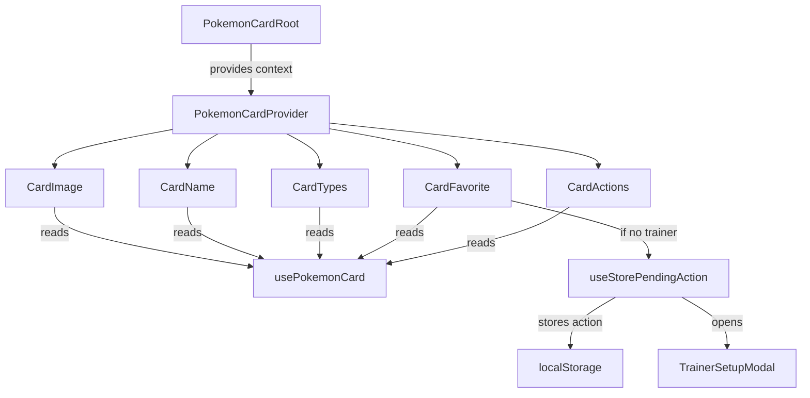

# Component Patterns

How we organize and build components in Snap. Covers compound components, co-located state, subdirectory conventions, and barrel exports.

---

## Subdirectory Structure

When a component grows beyond a single file, give it a subdirectory:

```
components/card/
├── state/                      # Co-located context + provider + hook
│   ├── card-context.tsx
│   ├── card-provider.tsx
│   └── use-pokemon-card.tsx
├── PokemonCard.tsx             # Root + sub-components
├── PokemonCard.module.css      # Styles
├── PokemonCardComposed.tsx     # Pre-composed convenience wrapper
└── index.ts                    # Barrel export
```

**Rules:**
- One component concept per subdirectory
- `state/` only exists when the component needs shared context
- CSS module matches the component filename
- `index.ts` re-exports public API only

---

## Compound Components

The **Object.assign** pattern lets consumers compose sub-components flexibly while sharing state through context.

### Step 1: Context

```tsx
// state/card-context.tsx
'use client';

import { createContext } from 'react';

export interface PokemonCardContextValue {
  id: number;
  name: string;
  image: string;
  types: string[];
}

export const PokemonCardContext = createContext<PokemonCardContextValue | undefined>(undefined);
```

### Step 2: Provider

```tsx
// state/card-provider.tsx
'use client';

import { useMemo, type ReactNode } from 'react';
import { PokemonCardContext, type PokemonCardContextValue } from './card-context';

interface PokemonCardProviderProps extends PokemonCardContextValue {
  children: ReactNode;
}

export function PokemonCardProvider({ children, ...value }: PokemonCardProviderProps) {
  const memoized = useMemo(() => value, [value.id, value.name, value.image, value.types]);

  return <PokemonCardContext value={memoized}>{children}</PokemonCardContext>;
}
```

### Step 3: Consumer hook

```tsx
// state/use-pokemon-card.tsx
'use client';

import { use } from 'react';
import { PokemonCardContext } from './card-context';

export function usePokemonCard() {
  const context = use(PokemonCardContext);

  if (!context) {
    throw new Error('usePokemonCard must be used within a PokemonCard');
  }

  return context;
}
```

### Step 4: Root + sub-components

```tsx
// PokemonCard.tsx
'use client';

import { Card as MantineCard, Text } from '@mantine/core';
import { PokemonCardProvider } from './state/card-provider';
import { usePokemonCard } from './state/use-pokemon-card';

function CardName() {
  const { name } = usePokemonCard();
  return <Text fw={600} tt="capitalize">{name}</Text>;
}

function CardId() {
  const { id } = usePokemonCard();
  return <Text size="xs" c="dimmed">#{String(id).padStart(3, '0')}</Text>;
}

// ... more sub-components ...

interface PokemonCardRootProps {
  id: number;
  name: string;
  image: string;
  types?: string[];
  children: React.ReactNode;
}

function PokemonCardRoot({ id, name, image, types, children }: PokemonCardRootProps) {
  return (
    <PokemonCardProvider id={id} name={name} image={image} types={types ?? []}>
      <MantineCard withBorder padding="md">
        {children}
      </MantineCard>
    </PokemonCardProvider>
  );
}

// Compound export
export const PokemonCard = Object.assign(PokemonCardRoot, {
  Name: CardName,
  Id: CardId,
  // ...
});
```

### Step 5: Usage

```tsx
// Flexible composition
<PokemonCard id={25} name="pikachu" image="/pikachu.png">
  <PokemonCard.Image />
  <PokemonCard.Name />
  <PokemonCard.Types />
</PokemonCard>

// Or use the pre-composed version for the standard layout
<PokemonCardComposed id={25} name="pikachu" image="/pikachu.png" />
```

---

## Data Flow



---

## Barrel Exports

Every directory has an `index.ts` that re-exports the public API:

```tsx
// components/card/index.ts
export { PokemonCard } from './PokemonCard';
export { PokemonCardComposed } from './PokemonCardComposed';
```

**Rules:**
- Only export what consumers need
- Internal files (context, provider) are not exported directly
- Consumers import from the directory, not the file: `import { PokemonCard } from '../card'`

---

## When to Use Each Pattern

| Pattern | Use When |
|---------|----------|
| **Simple component** | Single file, no shared state, straightforward rendering |
| **Compound component** | Multiple sub-parts that share state, consumers need layout flexibility |
| **Pre-composed wrapper** | You want a convenience default that uses the compound component internally |
| **Co-located state** | Component needs context but it's scoped to that component, not global |
| **Global state** (`src/state/`) | State shared across multiple domains or the entire app |
