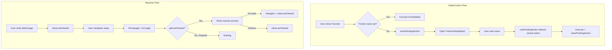

# Deferred Actions

Pattern for storing user actions when a precondition isn't met and executing them later. Also used for "continue where you left off" resume flows.

---

## Overview

Two use cases built on the same localStorage storage layer:

1. **Gated actions** — User clicks "favorite" but hasn't set their trainer name yet. The action is stored and auto-executed after they complete setup.
2. **Resume flow** — User views a Pokemon detail page, leaves, then comes back. The homepage or list page offers to take them back.



---

## Storage Layer

All functions live in `src/shared/utils/pending-action.ts`.

### Two storage slots

| Slot | Key | Default Expiry | Purpose |
|------|-----|---------------|---------|
| Pending action | `pending_pokemon_action` | 10 minutes | Deferred favorites/compares |
| Last viewed | `last_viewed_pokemon` | 24 hours | Resume flow |

Both use `localStorage` so they persist across tabs and browser restarts. The timestamp-based expiry auto-cleans stale entries on read.

### Custom expiry per key

```typescript
const DEFAULT_MAX_AGE_MS = 24 * 60 * 60 * 1000; // 24 hours

const keyMaxAge: Record<string, number> = {
  [STORAGE_KEY]: 10 * 60 * 1000, // 10 minutes for deferred actions
};
```

Add a new key to `keyMaxAge` to override the default. Keys not in the map use 24 hours.

### API

```typescript
// Deferred actions
storePendingAction({ type: 'favorite', pokemonId: 25, pokemonName: 'pikachu' });
getPendingAction();       // PendingAction | null
clearPendingAction();
hasPendingActionFor(25);  // boolean

// Last viewed
storeLastViewed(25, 'pikachu');
getLastViewed();          // PendingAction | null
clearLastViewed();
```

### PendingAction shape

```typescript
interface PendingAction {
  type: 'favorite' | 'compare' | 'view';
  pokemonId: number;
  pokemonName: string;
  timestamp: number;  // Set automatically by store functions
}
```

---

## Hooks

All hooks live in `src/shared/hooks/use-pending-action.tsx`.

### usePendingAction

Auto-executes a stored pending action when the precondition (trainer name) is met.

```tsx
function PokemonDetail({ pokemon }) {
  const [isFavorite, setIsFavorite] = useState(false);

  usePendingAction(pokemon.id, pokemon.name, {
    onFavoriteExecuted: () => setIsFavorite(true),
    onComparePending: () => openCompareModal(),
  });

  return <div>...</div>;
}
```

**How it works:**
1. Checks if `trainerName` is set (via `useTrainer`)
2. Checks if there's a pending action for this `pokemonId`
3. If both pass, executes the action and clears storage
4. Uses a `hasProcessedRef` to prevent double execution

### useStorePendingAction

Stores an action and opens the trainer setup modal if the precondition isn't met.

```tsx
function FavoriteButton({ pokemonId, pokemonName }) {
  const { store, needsSetup } = useStorePendingAction();

  const handleClick = () => {
    // Returns true if action was deferred, false if precondition is met
    const deferred = store('favorite', pokemonId, pokemonName);
    if (deferred) return; // Modal opened, action stored

    // Execute immediately
    setIsFavorite(true);
  };
}
```

### usePendingActionState

Check if there's a pending action for a specific Pokemon. Useful for loading states.

```tsx
const { hasPendingAction, pendingActionType } = usePendingActionState(pokemonId);
```

---

## Trainer Gate (Precondition)

The trainer name is the precondition that gates deferred actions. Located in `src/state/trainer/`.

| File | Purpose |
|------|---------|
| `trainer-context.tsx` | Context with `trainerName`, `openSetup`, `setTrainerName` |
| `trainer-provider.tsx` | Provider that persists name to `localStorage` |
| `use-trainer.tsx` | Consumer hook |
| `TrainerSetupModal.tsx` | Modal prompting for trainer name |

**In production (catch-the-light):** the precondition is Clerk authentication. Unauthenticated users get their actions deferred until after sign-in. The same pattern works with any precondition.

---

## Resume Flow: "Continue Where You Left Off"

### Storing (detail page)

`PokemonDetailClient` stores the viewed Pokemon on mount:

```tsx
useEffect(() => {
  if (pokemon) {
    storeLastViewed(pokemon.id, pokemon.name);
  }
}, [pokemon]);
```

### Prompting (homepage)

The `ResumeModal` on the homepage reads from storage and shows a modal:

```tsx
function ResumeModal() {
  const [pokemonName, setPokemonName] = useState<string | null>(null);

  useEffect(() => {
    const lastViewed = getLastViewed();
    if (lastViewed) setPokemonName(lastViewed.pokemonName);
  }, []);

  const handleClose = () => {
    clearLastViewed();
    setPokemonName(null);
  };

  // "Go back" navigates + clears, "No thanks" just clears
}
```

### Prompting (list page)

The `ResumeViewedBanner` shows an inline banner with the same logic:

```tsx
function ResumeViewedBanner() {
  const [lastViewed, setLastViewed] = useState<PendingAction | null>(null);

  useEffect(() => {
    setLastViewed(getLastViewed());
  }, []);

  // "Go back" navigates + clears, dismiss (X) just clears
}
```

Both approaches read on mount via `useEffect` (client-only) to avoid hydration mismatches.

---

## Adding a New Deferred Action Type

1. **Add the type** to `PendingActionType`:

```typescript
export type PendingActionType = 'favorite' | 'compare' | 'view' | 'share';
```

2. **Handle it** in `usePendingAction`:

```typescript
case 'share':
  callbacks?.onSharePending?.();
  return true;
```

3. **Store it** from a component:

```tsx
const { store } = useStorePendingAction();
store('share', pokemon.id, pokemon.name);
```

---

## File Locations

```
src/shared/
├── utils/
│   └── pending-action.ts          # Storage layer (store, get, clear)
└── hooks/
    └── use-pending-action.tsx      # Hooks (usePendingAction, useStorePendingAction)

src/state/trainer/
├── trainer-context.tsx             # Precondition context
├── trainer-provider.tsx            # Provider (localStorage)
├── use-trainer.tsx                 # Consumer hook
├── TrainerSetupModal.tsx           # Setup modal
└── index.ts

src/domains/pokemon/components/
├── card/PokemonCard.tsx            # CardFavorite uses useStorePendingAction
├── detail/PokemonDetailClient.tsx  # usePendingAction + storeLastViewed
├── list/ResumeViewedBanner.tsx     # getLastViewed banner
src/app/page.tsx                    # ResumeModal on homepage
```
