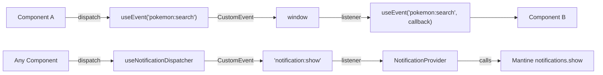

# Events & Notifications

Type-safe event system built on browser CustomEvents. Decouples component communication and powers the notification dispatcher.

---

## Architecture



**Key rule:** Components never call `notifications.show()` from Mantine directly. Always go through the event dispatcher.

---

## Core: useEvent Hook

Type-safe hook for dispatching and listening to custom DOM events.

```typescript
// src/events/use-event.ts
export const useEvent = <EventName extends keyof CustomWindowEventMap>(
  eventName: EventName,
  callback?: (payload) => void
) => {
  // Registers listener on mount, cleans up on unmount
  // Returns { dispatch } for firing events
};
```

### Dispatching

```tsx
const { dispatch } = useEvent('pokemon:search');

dispatch({ query: 'pikachu', resultCount: 1 });
```

### Listening

```tsx
useEvent('pokemon:search', (payload) => {
  console.log(`Searched for "${payload.query}", found ${payload.resultCount}`);
});
```

### Both in one component

```tsx
const { dispatch: dispatchPageChanged } = useEvent('pokemon:page-changed');

// Listen for page changes
useEvent('pokemon:page-changed', (payload) => {
  notificationDispatcher.show({
    message: `Showing page ${payload.page}`,
    type: 'info',
  });
});

// Dispatch when page changes
dispatchPageChanged({ page: 2, offset: 20 });
```

---

## Event Domains

Events are grouped by domain. Each domain defines a TypeScript interface.

### Notification events

```typescript
// src/events/notification-events.ts
export interface NotificationEvents {
  'notification:show': AppEvent<{
    message: string;
    type: 'success' | 'error' | 'info' | 'warning';
    duration?: number;
    persistent?: boolean;
  }>;
}
```

### Pokemon events

```typescript
// src/events/pokemon-events.ts
export interface PokemonEvents {
  'pokemon:search': AppEvent<{
    query: string;
    resultCount: number;
  }>;
  'pokemon:viewed': AppEvent<{
    pokemonId: number;
    pokemonName: string;
  }>;
  'pokemon:page-changed': AppEvent<{
    page: number;
    offset: number;
  }>;
}
```

### Combined event map

```typescript
// src/events/index.ts
export interface CustomWindowEventMap
  extends WindowEventMap,
    NotificationEvents,
    PokemonEvents {}
```

This union gives `useEvent` full type inference — the event name autocompletes and the payload is typed.

---

## Adding a New Event Domain

1. **Create the events file:**

```typescript
// src/events/trainer-events.ts
import type { AppEvent } from './types';

export interface TrainerEvents {
  'trainer:name-set': AppEvent<{ name: string }>;
  'trainer:cleared': AppEvent<void>;
}
```

2. **Add to the combined map:**

```typescript
// src/events/index.ts
import type { TrainerEvents } from './trainer-events';

export interface CustomWindowEventMap
  extends WindowEventMap,
    NotificationEvents,
    PokemonEvents,
    TrainerEvents {}
```

3. **Use it:**

```tsx
const { dispatch } = useEvent('trainer:name-set');
dispatch({ name: 'Ash' });

useEvent('trainer:cleared', () => {
  // react to trainer name being cleared
});
```

---

## Notification Dispatcher

A convenience wrapper over `useEvent('notification:show')`.

```tsx
import { useNotificationDispatcher } from '~/events';

const notificationDispatcher = useNotificationDispatcher();

// Show a success toast
notificationDispatcher.show({
  message: 'Pikachu added to favorites!',
  type: 'success',
});

// Show an error
notificationDispatcher.show({
  message: 'Failed to load Pokemon',
  type: 'error',
});

// Show a persistent notification (no auto-close)
notificationDispatcher.show({
  message: 'No internet connection.',
  type: 'error',
  persistent: true,
});
```

### How it works

1. `useNotificationDispatcher().show()` dispatches a `'notification:show'` CustomEvent
2. `NotificationProvider` (in `src/state/notifications/`) listens for this event
3. Provider calls `notifications.show()` from Mantine with the correct color mapping

### Color mapping

| Type | Mantine Color |
|------|---------------|
| `success` | `green` |
| `error` | `red` |
| `info` | `blue` |
| `warning` | `yellow` |

---

## Network Status Monitor

`NetworkStatusMonitor` is a renderless component in `src/shared/components/NetworkStatusMonitor/` that automatically detects network changes and dispatches notifications:

| Condition | Notification Type | Behavior |
|-----------|------------------|----------|
| Goes offline | `error` (persistent) | Stays until dismissed |
| Back online | `success` (3s) | Only if previously offline |
| Slow connection (2g, slow-2g, RTT > 1s, < 0.5 Mbps) | `warning` (8s) | Shown once per slow period |

It's mounted in `AppProviders` alongside `TrainerSetupModal`. Uses the [Network Information API](https://developer.mozilla.org/en-US/docs/Web/API/Network_Information_API) where available, with graceful fallback to basic `online`/`offline` events.

---

## Why Events Instead of Direct Calls?

| Direct call | Event-driven |
|------------|-------------|
| Component tightly coupled to Mantine | Component only knows about event types |
| Hard to add analytics/logging | Add listeners without touching dispatchers |
| Notification logic scattered | Centralized in NotificationProvider |
| Difficult to test | Mock the event, not the UI library |

---

## Best Practices

- **Naming:** Use `domain:action` format (`pokemon:viewed`, `notification:show`)
- **Payloads:** Keep them small and serializable
- **Listeners:** Clean up automatically via the hook's `useEffect` return
- **Don't overuse:** Events are for cross-cutting communication. For parent-child, use props. For sibling components in the same compound, use context.
