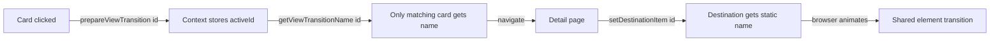

# View Transitions

Smooth shared-element page transitions using React's `<ViewTransition>` component and a custom `useViewTransition` hook.

---

## The Problem

React's `<ViewTransition name="...">` requires a unique `name` per element in the DOM. In a list page with 20 Pokemon cards, giving every card the same transition name would create conflicts. Only the card being clicked should have a transition name active.

## The Solution

A context-based hook that conditionally assigns the `view-transition-name` only to the element the user is interacting with.



---

## Architecture

### Context state

```typescript
interface ViewTransitionState {
  itemId: string | null;      // Which item is transitioning
  instanceId: number;         // Prevents stale matches
}
```

### Hook API

```typescript
const {
  getViewTransitionName,     // Returns name only if IDs match (source mode)
  prepareViewTransition,     // Set source with flushSync (forward nav)
  setDestinationItem,        // Set destination async (on detail mount)
  setDestinationItemSync,    // Set destination with flushSync (back nav)
  clearViewTransition,       // Reset state
} = useViewTransition();
```

---

## Usage Patterns

### 1. Source element (list page card)

The card uses `getViewTransitionName` which only returns a name if this card's ID matches the active transition.

```tsx
function CardImage() {
  const { id, name, image } = usePokemonCard();
  const { getViewTransitionName, prepareViewTransition } = useViewTransition();

  return (
    <NavLink href={`/pokemon/${name}`} onClick={() => prepareViewTransition(String(id))}>
      <ViewTransition name={getViewTransitionName(String(id))}>
        <Image src={image} alt={name} width={200} height={200} />
      </ViewTransition>
    </NavLink>
  );
}
```

**How it works:**
1. User clicks card → `prepareViewTransition('25')` stores ID with `flushSync`
2. `getViewTransitionName('25')` returns `"item-image-25"` for the matching card
3. All other cards return `undefined` (no transition name = no conflict)
4. Browser animates from source to destination

### 2. Destination element (detail page)

Uses a **static** transition name — no conditional logic needed since there's only one element.

```tsx
<ViewTransition name={`item-image-${pokemon.id}`}>
  <Image src={pokemon.image} alt={pokemon.name} width={300} height={300} />
</ViewTransition>
```

On mount, tell the context which item we're showing:

```tsx
useEffect(() => {
  if (pokemon) {
    setDestinationItem(String(pokemon.id));
  }
}, [pokemon, setDestinationItem]);
```

### 3. Back navigation

When navigating back from detail → list, use `setDestinationItemSync` (with `flushSync`) so the transition name is set before navigation starts:

```tsx
<Button
  component={NavLink}
  href="/pokemon"
  onClick={() => setDestinationItemSync(String(pokemon.id))}
>
  Back to Pokedex
</Button>
```

---

## Key Rules

| Scenario | Function | Why |
|----------|----------|-----|
| Forward navigation (click card) | `prepareViewTransition(id)` | Sets source with `flushSync` before nav |
| Detail page mount | `setDestinationItem(id)` | Async is fine — page is already rendering |
| Back navigation (click back) | `setDestinationItemSync(id)` | Needs `flushSync` so name is set before nav |
| Source elements (list) | `getViewTransitionName(id)` | Conditional — only active item gets a name |
| Destination elements (detail) | Static `name={...}` | Always has the name — only one element |

---

## Important Caveats

1. **Never call `flushSync` functions inside `useEffect`** — React will throw. Use them only in event handlers (onClick, etc.)

2. **Transition names must match** — source `getViewTransitionName('25')` returns `"item-image-25"`, destination must use `name={`item-image-${pokemon.id}`}` with the same prefix

3. **Browser support** — View Transitions API is supported in Chromium browsers. Falls back gracefully to instant navigation in Firefox/Safari (no animation, no errors)

4. **One transition at a time** — the context only tracks a single active item. Starting a new transition clears the previous one

---

## File Locations

```
src/state/view-transition/
├── view-transition-context.tsx   # Context definition
├── view-transition-provider.tsx  # Provider with state management
├── use-view-transition.tsx       # Hook with all transition functions
└── index.ts                      # Barrel export
```
